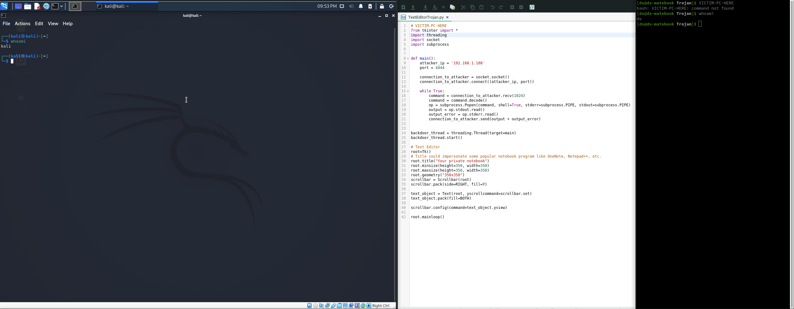

# TextEditorTrojanBackdoor

## Description:
### Text Editor Trojan backdoor created for educational purposes.

## Steps
1. Execute netcat listener on attacker box.
2. Make sure attacker box ip is correctly set before infecting victim computer.
3. Start Text Editor program on victim computer.
4. Have fun.

